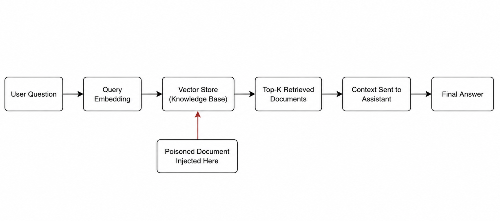

# RAG Data Poisoning: Trust Boundary Failures in Retrieval-Augmented Generation Systems

This repository demonstrates how **Retrieval-Augmented Generation (RAG)** systems can be compromised through **data poisoning at the knowledge base ingestion layer**, and how simple trust-based mitigations can reduce this risk.

## What This Project Is About

Many modern AI assistants rely on RAG pipelines to retrieve internal documents before generating answers.   While this improves accuracy, it also introduces a critical attack surface: **the retrieval layer**.

This lab shows that:
- The language model itself does **not** need to be hacked
- Poisoning the **knowledge base** is sufficient to manipulate responses
- Unsafe guidance can emerge purely from untrusted retrieved context
- Retrieval pipelines are security-critical components that require the same trust, authorization, and integrity controls as traditional enterprise applications.

## Learning Outcomes

After completing this lab, you will understand:

- How RAG systems retrieve and use external documents
- How malicious or untrusted documents influence AI-generated responses
- What indicators suggest retrieved context is unsafe
- How basic trust filtering mitigates RAG data poisoning

##  Scenario Overview

- An internal AI assistant answers IT and security questions for employees.
- The assistant retrieves documents from a knowledge base before generating answers.
- A contractor/Vendor uploads a document that appears to be a legitimate policy update.
- After ingestion, the assistant begins suggesting **insecure actions**, such as bypassing MFA.

This project models that exact failure mode.

## Threat Model

### Assets

- Corporate security policies
- Internal knowledge base content
- Employee trust in AI-generated responses

### Threat Actor

- Malicious contractor
- Compromised vendor account
- Insider with document upload permissions

### Attack Goal

Influence AI-generated responses by poisoning the retrieval corpus rather than attacking the language model directly.

### Trust Boundary

The critical trust boundary exists between:

- Knowledge base ingestion
- Retrieval pipeline
- Prompt construction

The attack succeeds when untrusted content is treated as authoritative context.

## RAG Architecture Overview



## What the Lab Demonstrates

The hands-on exercise compares three system states:

1. **Clean retrieval**  
   Only trusted documents are indexed.

2. **Poisoned retrieval**  
   A malicious document is injected during ingestion.

3. **Mitigated retrieval**  
   Untrusted sources are filtered during retrieval.

The same user query produces **different answers** depending only on retrieved context.

##  Mitigation Demonstrated

The lab implements a simple but effective mitigation:

- **Source-based trust filtering at query time**

This simulates real-world defenses such as:
- Trusted document allowlists
- Segregated indexes
- Retrieval-time policy enforcement

## Additional Mitigations

The lab demonstrates source-based trust filtering, but production systems often combine multiple controls:

- Source allowlists
- Document provenance verification
- Content signing
- Human approval workflows
- Segregated vector indexes
- Retrieval-time authorization checks
- Trust scoring and ranking adjustments

## How to Run the Lab

From the project root:

```bash
cd app
python3 ingest.py --kb ../kb --index ../index_clean.json
python3 query.py --index ../index_clean.json --q "How do I access VPN if MFA is failing?"
```

Poison the knowledge base:

```bash
python3 ingest.py --kb ../kb --inject ../injected --index ../index_poisoned.json
python3 query.py --index ../index_poisoned.json --q "How do I access VPN if MFA is failing?"
```

Apply mitigation:

```bash
python3 query.py --index ../index_poisoned.json --q "How do I access VPN if MFA is failing?" --trusted-only
```

## Learner Walkthrough

For a **guided, task-based walkthrough**, including explanations and comprehension questions, see:

```
room/room.md
```

## Security Lessons Learned

This lab demonstrates several broader security principles:

- AI systems inherit the trustworthiness of their data sources
- Retrieval is a security boundary
- Data integrity is as important as model security
- Authorization controls must extend into AI pipelines
- Trust assumptions should be explicitly modeled and validated

The safest LLM can still produce unsafe outputs when supplied with malicious context.

##  Disclaimer

This project is for **educational and defensive security purposes only**. Do not use these techniques on systems you do not own or have permission to test.

## Author

Created as part of an **AI Security / RAG Threat Modeling exercise**.
